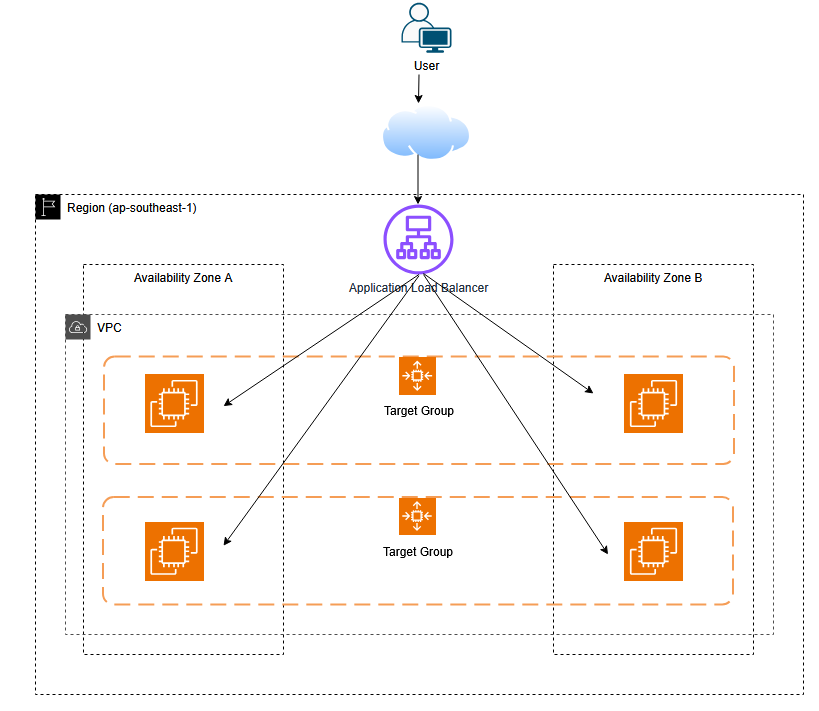

# Project 02 — Highly Available Web Platform with ALB & Auto Scaling (Multi-AZ)

### 1. Business Requirement

The startup has evolved from a simple single-instance landing page into a public-facing web platform with requirements:

- Remain available during instance failure
- Handle traffic bursts from marketing campaigns
- Avoid direct exposure of application servers to the internet
- Be deployable entirely via Terraform
- Follow production-ready AWS architecture patterns

*Key Constraints*

- **Budget-conscious**, but willing to pay for core production components (ALB, NAT)
- **Availability expectation:** tolerate instance failure and AZ-level disruption
- **Traffic pattern:** low baseline, burst traffic during campaigns
- **Security requirement:** no SSH access, private application tier

### 2. Architecture Design

**Core Design**

This system implements the standard AWS web-tier pattern:

```plain text
Internet → Application Load Balancer → Target Group → Auto Scaling Group → EC2 Instances
```

Key characteristics:

- **Public ALB** handles all inbound traffic
- **Private EC2 instances** serve application traffic
- **Auto Scaling Group (ASG)** maintains fleet health and size
- **Multi-AZ deployment** ensures resilience
- **NAT Gateway** enables outbound internet access from private subnets
- **SSM Session Manager** replaces SSH for administration

This is the baseline architecture used in real production systems.

**Limitations**

This design is production-shaped but not production-complete:

- No HTTPS (HTTP only)
- No WAF or DDoS protection layer
- NAT Gateway introduces cost
- No centralized logging (e.g., ELK, OpenSearch)
- No CI/CD pipeline (manual Terraform apply)
- No database tier
- No blue/green or rolling deployment strategy

Failure scenarios:

- NAT Gateway failure impacts outbound traffic
- ALB misconfiguration breaks entire service
- Incorrect health check path causes zero healthy targets

**AWS Services Used**

| Service | Purpose |
|--------|--------|
| **Amazon VPC** | Network isolation |
| **Subnets (Public/Private)** | Tier separation |
| **Internet Gateway** | Public internet access |
| **NAT Gateway** | Private subnet outbound internet |
| **Application Load Balancer (ALB)** | Public entry point |
| **Target Group** | Health-based traffic routing |
| **EC2** | Application compute |
| **Launch Template** | Immutable instance configuration |
| **Auto Scaling Group (ASG)** | Fleet management |
| **IAM (Instance Role)** | Secure EC2 permissions |
| **AWS Systems Manager (SSM)** | Secure admin access (no SSH) |
| **CloudWatch** | Metrics and alarms |

**Network Design**

#### VPC
CIDR: 10.20.0.0/16

#### Subnets

| Type | CIDR | AZ |
|------|------|----|
| Public-1 | 10.20.1.0/24 | AZ-1 |
| Public-2 | 10.20.2.0/24 | AZ-2 |
| Private-App-1 | 10.20.11.0/24 | AZ-1 |
| Private-App-2 | 10.20.12.0/24 | AZ-2 |

#### Routing

**Public Subnets**
0.0.0.0/0 → Internet Gateway

**Private Subnets**
0.0.0.0/0 → NAT Gateway

#### Security Groups

**ALB SG**
- Inbound: HTTP (80) from 0.0.0.0/0
- Outbound: all

**App SG**
- Inbound: HTTP (80) from ALB SG only
- Outbound: all

### Data Flow

1. User sends HTTP request from browser
2. Request hits **Application Load Balancer**
3. ALB forwards request to **Target Group**
4. Target Group selects a **healthy EC2 instance**
5. Request reaches EC2 (Nginx)
6. Response is returned to ALB
7. ALB sends response back to user

### Internal Flow

- EC2 instances pull packages via NAT Gateway
- Admin connects via **SSM Session Manager**
- CloudWatch collects metrics and triggers alarms

### Architecture Diagram



```text
VPC (10.20.0.0/16)
├── Public Subnets (ALB + NAT)
└── Private App Subnets (EC2 ASG)
```

